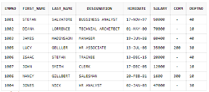

# hrms-demo

This project is a demo for a .NET 8 API. It is designed to practice Clean Architecture Design and uses the CQRS pattern with MediatR.

## Features

- **.NET 8 API**: Built with the latest version of .NET.
- **Clean Architecture**: Follows the principles of Clean Architecture to ensure a maintainable and scalable codebase.
- **CQRS Pattern**: Implements the Command Query Responsibility Segregation (CQRS) pattern to separate read and write operations.
- **MediatR**: Utilizes MediatR for handling requests and notifications in a decoupled manner.

## Overview

This project is for managing employee data. Below is an image that provides an overview of the system:




## Getting Started

To get started with this project, follow these steps:

1. Clone the repository:
    ```sh
    git clone https://github.com/yourusername/hrms-demo.git
    ```
2. Navigate to the project directory:
    ```sh
    cd hrms-demo
    ```
3. Build the project:
    ```sh
    dotnet build
    ```
4. Run the project:
    ```sh
    dotnet run
    ```

## Contributing

Contributions are welcome! Please open an issue or submit a pull request for any improvements or bug fixes.

## License

This